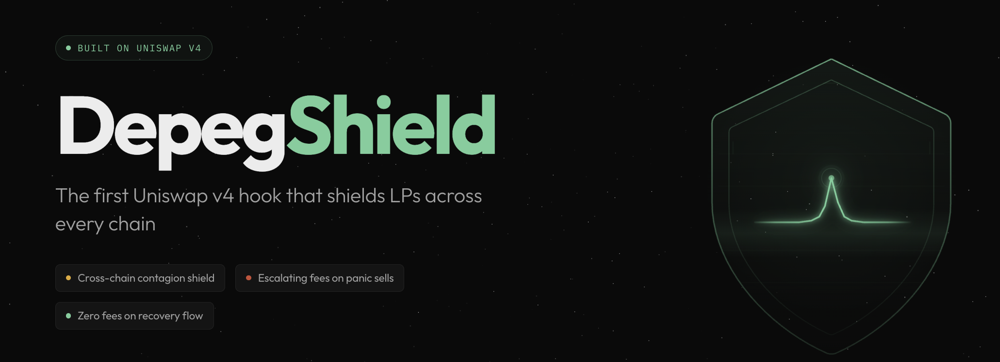
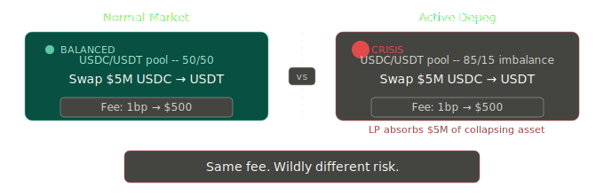
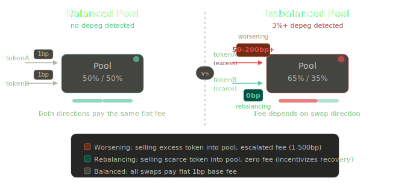
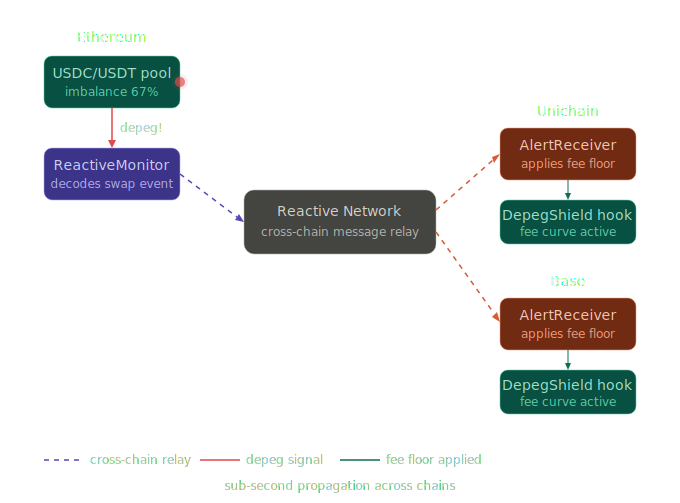
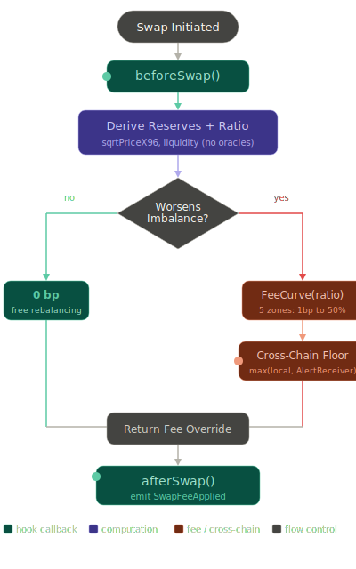

<p align="center">
  
</p>

<p align="center">
  <a href="https://depeg-shield.vercel.app/"><strong>Live Demo</strong></a>
</p>

---

# The Problem

Stablecoin pools on Uniswap charge flat fees. That works fine in normal markets. During a depeg, it's catastrophic.

## 1. Fees Don't Reflect Risk

A \$5M panic swap during an active depeg pays the same 1bp fee as a routine swap in a balanced pool. The LP earns \$500 for absorbing \$5M of a potentially collapsing asset. This is devastating because of how AMMs work: LPs concentrate around the 1:1 peg, and as selling pressure pushes through, the AMM mechanically converts their entire position into the stressed asset at near-par rates. Informed traders extract the scarce token before prices reflect reality, and the pool charges them effectively nothing for it.

<p align="center">
  
</p>

## 2. Pools on Other Chains Can't See It Coming

A depeg surfaces first on high-volume chains like Ethereum. Pools on L2s still see balanced reserves and charge flat fees while arbitrageurs bridge the depegging token over, drain the scarce asset at par, and exit. During the SVB/USDC crisis, Ethereum was at \$0.87 while L2 pools were still trading USDC at \$1.

<p align="center">
  
</p>

**The result:** LPs are involuntary insurance underwriters with no information edge, providing exit liquidity to panicking traders and cross-chain arbitrageurs at maximum downside for near-zero compensation.

---

# The Solution

DepegShield is a Uniswap v4 hook that makes stablecoin pool fees **responsive to risk**.

## 1. Adaptive Directional Fees

Every swap, the hook reads pool state on-chain (no oracles, no off-chain dependencies) and computes an imbalance ratio from virtual reserves. That ratio maps to a 5-zone fee curve that escalates from 1bp to a 50% cap as the depeg worsens:

<p align="center">
  
</p>

Fees are **asymmetric**: only swaps that worsen the imbalance pay escalated fees. Swaps that rebalance the pool pay **zero fees**, turning every imbalanced state into an arbitrage opportunity that pulls the pool back to health.

<p align="center">
  
</p>

## 2. Cross-Chain Depeg Detection

A **ReactiveMonitor** on [Reactive Network](https://reactive.network/) subscribes to swap events across chains, tracks cumulative imbalance, and fires cross-chain callbacks when a threshold is breached. The local **AlertReceiver** stores the alert, and the hook applies it as a fee floor. Even a locally-balanced pool charges elevated fees if a cross-chain depeg is underway.

<p align="center">
  
</p>

The monitor can attach to any Uniswap V2, V3, or V4 pool on any supported chain. No off-chain bots. Fully on-chain.

---

## Hook Flow

<p align="center">
  
</p>

| Step | What happens | Code |
| ---- | ------------ | ---- |
| `beforeSwap()` | Entry point. Calls `_computeSwapFee()`, stores fee in transient storage, returns with `OVERRIDE_FEE_FLAG` | [`DepegShieldHook.sol`](contracts/src/DepegShieldHook.sol) |
| Derive reserves | Reads `sqrtPriceX96` + `liquidity` from PoolManager, computes virtual reserves and imbalance ratio. No oracles | [`DepegShieldHook.sol`](contracts/src/DepegShieldHook.sol) |
| Direction check | Determines if the swap worsens or rebalances the imbalance based on which token is in excess | [`DepegShieldHook.sol`](contracts/src/DepegShieldHook.sol) |
| Fee curve | 5-zone adaptive curve (1bp to 50% cap). Rebalancing swaps pay 0bp | [`FeeCurve.sol`](contracts/src/FeeCurve.sol) |
| Cross-chain floor | For worsening swaps only: `max(localFee, FeeCurve(crossChainRatio))`. Reads alerts from AlertReceiver | [`AlertReceiver.sol`](contracts/src/AlertReceiver.sol) |
| `afterSwap()` | Reads fee from transient storage, emits `SwapFeeApplied` with post-swap state | [`DepegShieldHook.sol`](contracts/src/DepegShieldHook.sol) |

**Reactive Network integration:** [`ReactiveMonitor.sol`](contracts/src/reactive/ReactiveMonitor.sol) ([deployed on Reactive Lasna](https://lasna.reactscan.net/address/0xf30180b9cec36f5a3762332c0f102fe8c024d64e/contract/0xfa5eeb94A58e5E83451C90E0915705E2d3a8EBA1)) subscribes to V2/V3/V4 swap events across chains. When a swap is detected, it decodes pool reserves, computes the imbalance ratio, and emits a cross-chain callback to [`AlertReceiver.sol`](contracts/src/AlertReceiver.sol) on each destination chain. The AlertReceiver stores the ratio per token pair. On the next swap, `DepegShieldHook._computeSwapFee()` reads this stored ratio and applies it as a fee floor: `max(localFee, FeeCurve(crossChainRatio))`. Config in [`05_DeployReactive.s.sol`](contracts/script/05_DeployReactive.s.sol).

**Unichain integration:** Hook deployed on Unichain Sepolia ([`DepegShieldHook`](https://sepolia.uniscan.xyz/address/0x05e5c38f6ca3e76c30145eb73f1128B7749140C0), [`AlertReceiver`](https://sepolia.uniscan.xyz/address/0xfe8BA3Fa183C98d637fd549f579670b3cB63b199)). Pool created via [`04_CreatePool.s.sol`](contracts/script/04_CreatePool.s.sol). Deploy scripts: [`03_DeployHook.s.sol`](contracts/script/03_DeployHook.s.sol).

---

# Simulations: Real Depeg Events

Foundry simulations of three real depeg events (`test/DepegScenario.t.sol`). Standard flat-fee pool vs DepegShield.

## 1. SVB / USDC Depeg | March 2023 | Recovery

USDC dropped to \$0.87 after Circle disclosed \$3.3B at SVB. Peg recovered in 48h.

| Wave | Pool Ratio | Zone | Standard | DepegShield |
| ------------ | ---------------- | --------- | -------- | ----------- |
| Early sells | 1.03x (3%) | Stress | 1bp | 1bp |
| Panic builds | 1.07x (7%) | Emergency | 1bp | ~50bp |
| Peak crisis | 1.12x (11%) | Emergency | 1bp | ~208bp |
| Late sellers | 1.15x (13%) | Emergency | 1bp | ~287bp |
| Recovery | ~1.03x | - | 1bp | 0bp (free) |

|                    | Standard | DepegShield |
| ------------------ | -------- | ----------- |
| Crisis fees earned | baseline | **65x more** |
| Recovery fees | 1bp | 0bp (free) |

Both sets of LPs broke even after recovery. DepegShield LPs earned **65x more fees** for bearing the same risk. Zero-fee rebalancing meant recovery arrived faster.

## 2. USDT Whale Attack | June 2023 | Recovery

A single entity dumped 31.5M USDT across DEX pools. Recovery within hours.

| Wave | Pool Ratio | Zone | Standard | DepegShield |
| --------- | ------------------ | ------- | -------- | ----------- |
| Tranche 1 | 1.01x (1%) | Stress | 1bp | 1bp |
| Tranche 2 | 1.02x (2%) | Stress | 1bp | ~5bp |
| Tranche 3 | 1.03x (3%) | Crisis | 1bp | ~16bp |
| Tranche 4 | 1.04x (4%) | Crisis | 1bp | ~50bp |
| Recovery | ~1.01x | - | 1bp | 0bp (free) |

|                      | Standard | DepegShield |
| -------------------- | -------- | ----------- |
| Attack fees earned | baseline | **18x more** |
| **Cost to attacker** | baseline | **18x more** |

DepegShield doubles as an anti-manipulation mechanism. The whale pays **18x more** in fees, all of which goes to LPs.

## 3. UST/LUNA Collapse | May 2022 | No Recovery

UST collapsed to \$0. Over \$50B destroyed. LPs suffered total loss.

| Wave | Pool Ratio | Zone | Standard | DepegShield |
| ------------- | -------------------- | --------- | -------- | --------------- |
| Initial panic | 1.10x (10%) | Emergency | 1bp | 1bp |
| Cascade sell | 1.55x (36%) | Emergency | 1bp | ~254bp |
| Death spiral | 2.23x (67%) | Emergency | 1bp | 5000bp (50%) |
| Final drain | 3.98x (87%) | Emergency | 1bp | 5000bp (50%) |

|                    | Standard | DepegShield |
| ------------------ | -------- | ----------- |
| Crisis fees earned | baseline | **4,314x more** |
| LP position value | \$0 | \$0 |

DepegShield can't prevent total loss. But LPs extract **4,314x more fees** from the panic sellers who drained the pool.

---

[Moody's tracked 1,900+ depeg events through mid-2023](https://www.theblock.co/post/261727/large-cap-stablecoins-have-depegged-609-times-this-year-moodys-analytics-says). In October 2025, [\$3.8B swung off parity](https://www.coingecko.com/learn/october-10-crypto-crash-explained) in a single flash crash. Across all scenarios: DepegShield LPs earn **18x to 4,314x more** for bearing identical risk.

---

# Research Basis

The mechanism design is grounded in academic research on stablecoin stability:

- **Run threshold theory.** Stablecoin stability is a coordination game where the run threshold is a function of transaction costs ([Ahmed et al., BIS 2025](https://www.bis.org/publ/work1164.pdf)). DepegShield raises that threshold dynamically by making swap fees responsive to crisis severity.

- **Target zone model.** Peg stability improves proportionally to the strength of the mean-reverting force ([Hui et al., JIMF 2025](https://www.sciencedirect.com/science/article/abs/pii/S0261560625000154)). The asymmetric fee curve is that force: escalating fees resist deviation, zero-fee rebalancing accelerates recovery.

- **Large sales attack vector.** Large speculative sales can destabilize markets independently of fundamentals ([Zhu, 2024](https://arxiv.org/abs/2408.07227)). The exponential fee curve makes pool manipulation at scale economically prohibitive.

---

# Project Structure

```
depegShield/
├── contracts/                    # Foundry project
│   ├── src/
│   │   ├── DepegShieldHook.sol   # Core hook: beforeSwap fee logic, afterSwap events
│   │   ├── FeeCurve.sol          # 5-zone fee curve library
│   │   ├── AlertReceiver.sol     # Cross-chain alert storage (per destination chain)
│   │   ├── MockStablecoin.sol    # Free-mint ERC20 for testnet demos
│   │   ├── interfaces/
│   │   │   └── IAlertReceiver.sol
│   │   └── reactive/
│   │       └── ReactiveMonitor.sol  # Reactive Network cross-chain monitor
│   ├── test/
│   │   ├── DepegShieldHook.t.sol # Hook behavior tests
│   │   ├── FeeCurve.t.sol        # Fee curve unit + fuzz tests
│   │   ├── DepegScenario.t.sol   # Depeg simulation scenarios
│   │   ├── AlertReceiver.t.sol   # Alert receiver + pair registry tests
│   │   └── CrossChainFee.t.sol   # Cross-chain fee floor tests
│   └── script/
│       ├── 01_DeployTokens.s.sol        # Deploy mUSDC + mUSDT via CREATE2
│       ├── 02_DeployAlertReceiver.s.sol  # Deploy AlertReceiver + register pair
│       ├── 03_DeployHook.s.sol           # Mine salt + deploy hook (CREATE2)
│       ├── 04_CreatePool.s.sol           # Init pool at 1:1 + seed liquidity
│       └── 05_DeployReactive.s.sol       # ReactiveMonitor config reference
│
├── frontend/                     # Next.js app
│   └── src/
│       ├── app/                  # Landing page + Explore page
│       ├── components/           # FeeCurveChart, SimulationReplay, PoolHealthGauge, CrossChainAlert
│       └── lib/                  # Fee curve math, simulation data
```

---

# Setup Guide

## Prerequisites

- [Foundry](https://book.getfoundry.sh/getting-started/installation) (run `foundryup` to install or update)
- [Node.js](https://nodejs.org/) 20+
- Git

## Installation

```bash
git clone https://github.com/aman035/depegShield.git
cd depegShield
git submodule update --init --recursive
```

## Contracts

```bash
cd contracts
forge build
forge test -vv
```

## Frontend

```bash
cd frontend
npm install
npm run dev
```

<details>
<summary><strong>Deploy (Testnet)</strong></summary>

Deployment uses 5 scripts in `contracts/script/`, run in order per chain. See each script for chain-specific env vars.

```bash
cd contracts
cp .env.example .env
source .env

# 1. Mock tokens (deterministic via CREATE2)
forge script script/01_DeployTokens.s.sol --rpc-url <RPC> --broadcast

# 2. AlertReceiver
CALLBACK_PROXY=0x... forge script script/02_DeployAlertReceiver.s.sol --rpc-url <RPC> --broadcast

# 3. DepegShieldHook (mines CREATE2 salt for flag-encoded address)
ALERT_RECEIVER=0x... forge script script/03_DeployHook.s.sol --rpc-url <RPC> --broadcast

# 4. Create pool + seed liquidity
HOOK=0x... forge script script/04_CreatePool.s.sol --rpc-url <RPC> --broadcast

# 5. ReactiveMonitor on Reactive Lasna (see 05_DeployReactive.s.sol for full config)
#    Uses cast send --create because forge create times out on Lasna.
#    All config MUST be in the constructor (ReactVM dual-state architecture).
```

</details>

---

# Testnet Deployments

All contracts verified. Mock tokens ([mUSDC `0x58C4...E8f0`](https://sepolia.etherscan.io/address/0x58C414Bd85bf1d39985476Dfa5fBd59af356E8f0), [mUSDT `0x2170...CC0`](https://sepolia.etherscan.io/address/0x2170d1eC7B1392611323A4c1793e580349CC5CC0)) share the same CREATE2 address on every chain.

| Chain | Contract | Address | Explorer |
| ----- | -------- | ------- | -------- |
| Sepolia | DepegShieldHook | `0xEDfFdab...C9f00C0` | [View](https://sepolia.etherscan.io/address/0xEDfFdabADd4263836403BF0D5F92a613Fc9f00C0) |
| Sepolia | AlertReceiver | `0x6bFe88...D825C3` | [View](https://sepolia.etherscan.io/address/0x6bFe889e87A51634194B9447201548BEc8D825C3) |
| Base Sepolia | DepegShieldHook | `0xf8Fd12...6780c0` | [View](https://sepolia.basescan.org/address/0xf8Fd12C76C606cA9bc3dAdeE9706B4357e6780c0) |
| Base Sepolia | AlertReceiver | `0x92a849...Ff22d` | [View](https://sepolia.basescan.org/address/0x92a8497C788d43572Fe29f144E6FF015AE3Ff22d) |
| Unichain Sepolia | DepegShieldHook | `0x05e5c3...9140C0` | [View](https://sepolia.uniscan.xyz/address/0x05e5c38f6ca3e76c30145eb73f1128B7749140C0) |
| Unichain Sepolia | AlertReceiver | `0xfe8BA3...b199` | [View](https://sepolia.uniscan.xyz/address/0xfe8BA3Fa183C98d637fd549f579670b3cB63b199) |
| Reactive Lasna | ReactiveMonitor | `0xfa5eeb...EBA1` | [View](https://lasna.reactscan.net/address/0xf30180b9cec36f5a3762332c0f102fe8c024d64e/contract/0xfa5eeb94A58e5E83451C90E0915705E2d3a8EBA1) |

Pools initialized at 1:1 price with dynamic fee flag (`0x800000`), tick spacing 10, and 100K liquidity per side.
